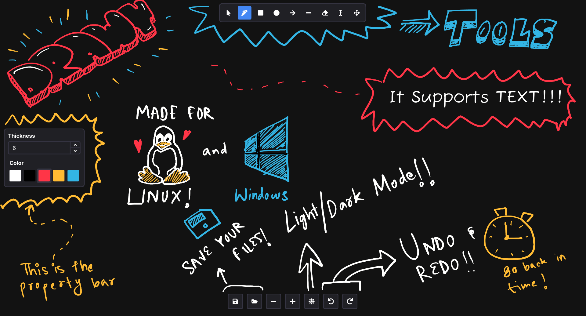

# ✏️ Drawy
Your handy, infinite, brainstorming tool.
---
Drawy is a work-in-progress infinite whiteboard tool written in Qt/C++, which aims to be a native-desktop alternative to the amazing web-based Excalidraw.

# Installation
Windows binaries will soon be available. For now, you can try the AppImage that works on all major Linux distributions.  
  

## Compiling from Source
- Install `cmake` and `g++`
- Install Qt 6.9 or above from [here](https://www.qt.io/download-qt-installer-oss) or using [aqtinstall](https://github.com/miurahr/aqtinstall)
- Clone this repository: `git clone https://github.com/prayag2/drawy && cd drawy`
- Setup cmake: `cmake -B build -S . -DCMAKE_BUILD_TYPE=Release`
- Compile: `cmake --build build --config Release`
- Run: `./build/drawy`

# Licence
This project uses the GNU Lesser General Public Licence.

# Support Me ♥
If you liked this project, then please consider supporting me!  
  

# TODOs
Started: `2025-01-02 04:40PM`  
Development is divided into phases.  
The project will eventually be open sourced. However, I will work on the first few phases myself, to maximize learning.  
The following is a list of features I'll be planning to add to it:  

## Phase 1 (Basic Features)
- [x] A simple fixed size canvas to draw on using a black coloured stroke.
- [x] Different shapes like rectangle, ellipse, arrow, line and stroke.
- [x] An eraser to erase the strokes (deleting the strokes).
- [x] Testing.

## Phase 2
- [x] Refactor to try to adhere to SOLID principles and utilize useful design patterns
- [x] A custom Qt layout for toolbar and properties bar
- [x] Make canvas infinite and add ability to move the viewport
- [x] Use an LRU cache based uniform grid to optimize moving the canvas around (now 100% faster!!)
- [x] A properties bar to change the following properties:
    - [x] Colour of strokes
    - [x] Stroke width  
  
## Phase 3
- [x] Buttons to zoom in/out
- [x] Pressure senstivity for drawing tablets
- [x] Selection tool to select items and do these actions:
    - [x] Move items
    - [x] Delete items
    - [ ] Transform items (resize) (Low priority)
    - [ ] Rotate items (Low priority)
- [x] Undo/redo support
- [x] Basic keybinding support
- [x] Saving the drawings
- [x] Text support
- [ ] Exporting drawings to PNGs
- [ ] Image support
- [ ] Text formatting like bold, underline, italics, etc.
- [ ] Better freeform smoothing algorithms
- [ ] Allow snapping
- [ ] Ability to store preferences
- [ ] A "settings" page 
- [ ] Better widgets
- [ ] Online collaboration

Feature requests are welcome!
