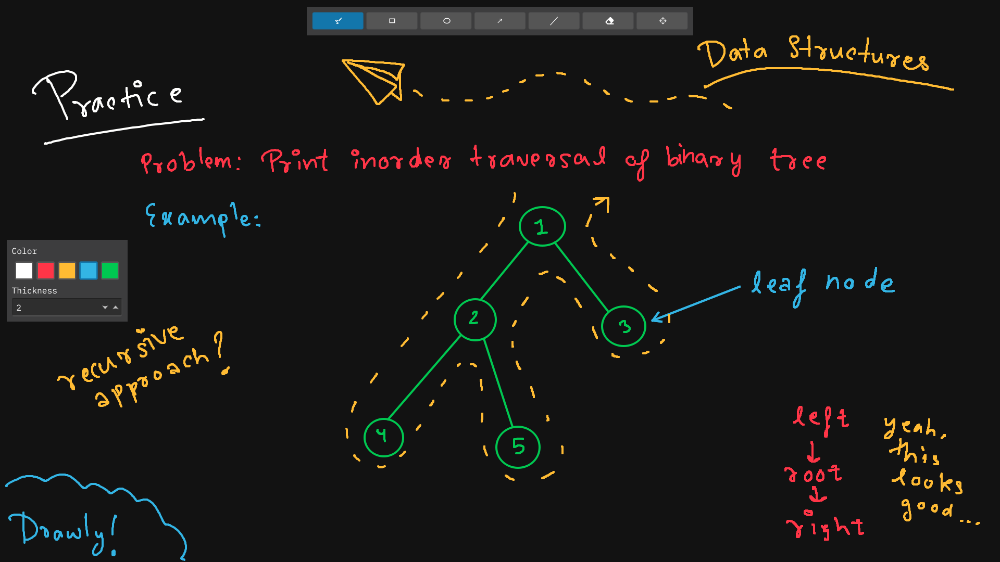

# ✏️ Drawly
Your handy, infinite, brainstorming tool.
---
Drawly is a work-in-progress infinite whiteboard tool, which aims to be a replacement for the web-based Excalidraw.  

## Note
I currently only work on this tool during the weekends. Development is slow, but consistent. I'm planning to release an alpha version during June 2025.

# Licence
This project uses the GNU Lesser General Public Licence.

# Plan
Started: `2025-01-02 04:40PM`  
Development is divided into phases.  
The project will eventually be open sourced. However, I will work on the first few phases myself, to maximize learning.  
The following is a list of features I'll be planning to add to it:  

## Phase 1 (Basic Features)
- [x] A simple fixed size canvas to draw on using a black coloured stroke.
- [x] Different shapes like rectangle, ellipse, arrow, line and stroke.
- [x] An eraser to erase the strokes (deleting the strokes).
- [x] Testing.

## Phase 2
- [x] Refactor to try to adhere to SOLID principles and utilize useful design patterns
- [x] A custom Qt layout for toolbar and properties bar
- [x] Make canvas infinite and add ability to move the viewport
- [x] Use an LRU cache based uniform grid to optimize moving the canvas around (now 100% faster!!)
- [x] A properties bar to change the following properties:
    - [x] Colour of strokes
    - [x] Stroke width  
  
Phase 2 completed!!

## Phase 3
- [x] Buttons to zoom in/out
- [x] Pressure senstivity for drawing tablets
- [x] Selection tool to select items and do these actions:
    - [x] Translate items (move)
    - [ ] Delete items (Low priority)
    - [ ] Transform items (resize) (Low priority)
    - [ ] Rotate items (Low priority)
- [ ] Undo/redo support
- [ ] Saving the drawings
- [ ] Exporting drawings to PNGs
- [ ] Shortcut keys (including pen buttons)
- [ ] Image support
- [ ] Text support
- [ ] Text formatting like bold, underline, italics, etc.
- [ ] Better freeform smoothing algorithms
- [ ] Allow snapping
- [ ] A "settings" page
- [ ] Better widgets
- [ ] UI overhaul
- [ ] Filling shapes with a background colour
- [ ] Collaboration
